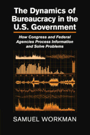

```{r, include=FALSE}
knitr::opts_chunk$set(
  results='asis', 
  echo = FALSE
)

library(glue)
library(tidyverse)

# ======================================================================
# These variables determine how the the data is loaded and how the exports are
# done.

# Is data stored in google sheets? If no data will be gather from the csvs/
# folder in project
using_googlesheets <- TRUE

# Just the copied URL from the sheet
positions_sheet_loc <- "https://docs.google.com/spreadsheets/d/1B9TwCBUF3SVDWuYQfIcbnv_viARhGI5r3faOrIHBZmk/edit?usp=sharing"

# Is this sheet available for anyone to read? If you're using a private sheet
# set this to false and go to gather_data.R and run the data loading manually
# once to cache authentication
sheet_is_publicly_readable <- TRUE

# Is the goal of this knit to build a document that is exported to PDF? If so
# set this to true to have links turned into footnotes at the end of the
# document
PDF_EXPORT <- FALSE


CV_PDF_LOC <- "https://github.com/SamuelWorkman/sworkman_cv/raw/master/sworkman_cv.pdf"
CV_HTML_LOC <- "http://www.samuelworkman.org/cv/"


# A global (gasp) variable that holds all the links that were inserted for
# placement at the end
links <- c()

# ======================================================================
# Now we source two external scripts. One contains functions for building the
# text output and the other loads up our data from either googlesheets or csvs

# Functions for building sections from CSV data
source('parsing_functions.R') 

# Load data for CV/Resume
source('gather_data.R')
```


```{r}
# When in export mode the little dots are unaligned, so fix that. 
if(PDF_EXPORT){
  cat("
  <style>
  :root{
    --decorator-outer-offset-left: -6.5px;
  }
  </style>")
}
```


Aside
================================================================================
{width=80%}

<!--{width=100px}-->

```{r}
# When in export mode the little dots are unaligned, so fix that. 
if(PDF_EXPORT){
  glue("View this CV online with links at _{CV_HTML_LOC}_")
} else {
  glue("[<i class='fas fa-download'></i> Download a PDF of this CV]({CV_PDF_LOC})") 
}
```

Contact {#contact}
--------------------------------------------------------------------------------

```{r}
contact_info %>% 
  glue_data("- <i class='fa fa-{icon}'></i> {contact}")
```

[get my book](https://www.amazon.com/Samuel-Workman/e/B01353W7UE){}
--------------------------------------------------------------------------------
{width=75%}


Disclaimer {#disclaimer}
--------------------------------------------------------------------------------

Last updated `r Sys.Date()`.


Main
================================================================================

Samuel Workman, Ph.D. {#title}
--------------------------------------------------------------------------------

```{r}
print_text_block(text_blocks, 'intro')
```


### Skills & Experience

* Policy research, data management, statistical analysis & modeling, presentation, reporting & data visualization, machine learning
* Project Management, grant writing, team leadership & coordination, public speaking
* Market, sales, and inventory analysis, reporting, and visualization, data-driven decision-making and management
* Languages: $R$, $\LaTeX$, SAS, SPSS, VBA, SQL, Markdown, CSS, HTML (limited)
* Applications: Rstudio, WinEdt, Beamer, binb, xaringan, MS Word, MS Excel, MS PowerPoint, SQLite, MS Access

Academic Positions {data-icon=university data-concise=true}
--------------------------------------------------------------------------------

```{r}
print_section(position_data, 'academic')
```

Private Sector Data & Statistical Consulting {data-icon=user-tie data-concise=true .break-before-me}
--------------------------------------------------------------------------------

```{r}
print_section(position_data, 'private')
```

Editorial Positions & Boards {data-icon=newspaper data-concise=true}
--------------------------------------------------------------------------------

```{r}
print_section(position_data, 'editorial')
```

Education {data-icon=graduation-cap data-concise=true}
--------------------------------------------------------------------------------

```{r}
print_section(position_data, 'education')
```

Training & Certificates {data-icon=certificate data-concise=true}
-----------------------------------------------------------------------------

```{r}
print_section(position_data, 'certificate')
```

\newpage

:::aside
<i class='ai ai-google-scholar'></i> [S. Workman - Google Scholar](https://scholar.google.com/citations?user=kW67_MkAAAAJ&hl=en)

##### Interests
* Public Policy
* Regulation
* Bureaucracy
* Agenda Setting
* Education Policy
* Use of Research & Data
* Food Policy & Food Systems

##### Approaches
* Text-as-Data
* Text Classification
* Machine Learning
* Maximum Likelihood
* Stochastic Processes

##### Current Projects
* Use of research in Education regulations
* The politics of data & numbers
* Complexity & the regulation of GMOs
* The politics of food security
:::


Books {data-icon=book data-concise=true}
--------------------------------------------------------------------------------

```{r}
print_section(position_data, 'book')
```


Articles {data-icon=paper-plane data-concise=true}
--------------------------------------------------------------------------------

```{r}
print_section(position_data, 'article')
```

Book Chapters {data-icon=book-open data-concise=true .break-after-me}
--------------------------------------------------------------------------------

```{r}
print_section(position_data, 'chapter')
```

Blogs {data-icon=feather-alt data-concise=true}
--------------------------------------------------------------------------------

```{r}
print_section(position_data, 'blog')
```

Interviews {data-icon=podcast data-concise=true}
--------------------------------------------------------------------------------

```{r}
print_section(position_data, 'interview')
```

\newpage

Reviews & Responses {data-icon=binoculars data-concise=true }
------------------------------------------------------------------------
```{r}
print_section(position_data, 'reviews_responses')
```

Grants & Awards {data-icon=award data-concise=true}
------------------------------------------------------------------------
:::aside
```{r}
print_text_block(text_blocks, 'funding_reviewer')
```
:::

```{r}
print_section(position_data, 'grant')
```

\newpage

Fellowships & Scholarships {data-icon=medal data-concise=true}
--------------------------------------------------------------------------------

```{r}
print_section(position_data, 'fellowships_scholarships')
```

Teaching
--------------------------------------------------------------------------------

:::aside
```{r}
print_text_block(text_blocks, 'teaching_approach')
```

```{r}
print_text_block(text_blocks, 'phd_mentees')
```
:::

Graduate Teaching {data-icon=school data-concise=true}
--------------------------------------------------------------------------------

```{r}
print_section(position_data, 'grad_teaching')
```

Undergraduate Teaching {data-icon=chalkboard-teacher data-concise=true .break-before-me}
--------------------------------------------------------------------------------
:::aside
```{r}
print_text_block(text_blocks, 'phd_comms')
```

```{r}
print_text_block(text_blocks, 'undergrad_mentees')
```
:::

```{r}
print_section(position_data, 'undergrad_teaching')
```

Public Lectures {data-icon=microphone-alt data-concise=true}
--------------------------------------------------------------------------------

```{r}
print_section(position_data, 'lecture')
```

Conference Presentations {data-icon=project-diagram .no-timeline}
--------------------------------------------------------------------------------
:::aside
```{r}
print_text_block(text_blocks, 'conf_chair')
```

```{r}
print_text_block(text_blocks, 'conf_discussant')
```
:::

```{r}
print_text_block(text_blocks, 'conf_papers')
```

Positions in Discipline {data-icon=sitemap data-concise=true}
--------------------------------------------------------------------------------

```{r}
print_section(position_data, 'discipline_positions')
```

Service {data-icon=tape data-concise=true}
--------------------------------------------------------------------------------

University
---------

```{r}
print_section(position_data, 'university_service')
```

Department
---

```{r}
print_section(position_data, 'department_service')
```

References {data-icon=pen-alt .break-before-me}
---

**Professor Bryan D. Jones**
: *J.J. “Jake” Pickle Regents Chair of Congressional Studies* 
: Department of Government $\circ$ The University of Texas at Austin $\circ$ 1 University Station A1800 $\circ$ Austin, TX 78712-0119 $\circ$ Ph. 512-471-9973 $\circ$ bdjones@austin.utexas.edu


**Professor Frank R. Baumgartner**
: *Richard J. Richardson Distinguished Professor of Political Science* 
: The University of North Carolina at Chapel Hill $\circ$ 358 Hamilton Hall $\circ$ Campus Box 3265 $\circ$ Chapel Hill, NC 27599-3265 $\circ$ Ph. 919-962-
3041 $\circ$ Frankb@unc.edu


**Professor David E. Lewis**
: *William R. Kenan, Jr. Professor of Political Science* 
: Department of Political Science $\circ$ Vanderbilt University $\circ$ PMB 505 $\circ$ 230 Appleton Place $\circ$ Nashville, TN 37203-5721 $\circ$ Ph. 615-322-6228 $\circ$
david.e.lewis@vanderbilt.edu


**Professor Andrew B. Whitford**
: *Alexander M. Crenshaw Professor of Public Policy*
: School of Public and International Affairs $\circ$ Department of Public Administration and Policy $\circ$ University of Georgia $\circ$ Baldwin Hall 412 $\circ$ 355 South Jackson Street $\circ$ Athens, GA 30602 $\circ$ Ph. 706-542-2898 $\circ$ aw@uga.edu


**Professor Christopher M.Weible**
: School of Public Affairs $\circ$ University of Colorado, Denver $\circ$ 1380 Lawrence Street, Suite 500 $\circ$ Denver, CO 80217-3364 $\circ$ Ph. 303-315-2010 $\circ$ chris.weible@ucdenver.edu


**Professor Anthony M. Bertelli**
: *Currently in residence at Bocconi University*
: *Sherwin-Whitmore Chair of Liberal Arts*
: Penn State School of Public Policy $\circ$ Penn State University $\circ$ 322 Pond Lab $\circ$ University Park, PA 16802 $\circ$ Ph. +39 347 3984 249 $\circ$ anthony.bertelli@unibocconi.it

**Professor Peter Bjerre Mortensen**
: Department of Political Science and Government $\circ$ Bartholins All´e 7 $\circ$ Building 1340, Room 333 $\circ$ 8000 Aarhus C $\circ$ Denmark $\circ$ Peter@ps.au.dk


**Professor Martin Lodge**
: *Professor of Political Science & Public Policy* 
: Department of Government $\circ$ London School of Economics $\circ$ Houghton Street $\circ$ CON 3.08, Connaught House $\circ$ London WC2A 2AE United Kingdom $\circ$ Ph. +44 (0)20 7849 4627 $\circ$ m.lodge@lse.ac.uk


**Professor John D.Wilkerson**
: *Director, Center for American Politics and Public Policy* 
: Department of Political Science $\circ$ University of Washington $\circ$ 101 Gowen Hall, Box 353530 $\circ$ Seattle, WA 98105-3530 $\circ$ Department of Political
Science $\circ$ University of Washington $\circ$ 101 Gowen Hall, Box 353530 $\circ$ Seattle, WA 98105-3530 $\circ$ Ph. 206-543-8030 $\circ$ jwilker@u.washington.edu


**Professor Peter John**
: *Professor of Political Science & Public Policy* 
: Department of Political Science $\circ$ The School of Public Policy $\circ$ University College London $\circ$ The Rubin Building $\circ$ 29/30 Tavistock Sq., Room 1.07 $\circ$ London, WC1H 9QU United Kingdom $\circ$ Ph. +44 (0)20 3108 1145 (x5114) $\circ$ peter.john@ucl.ac.uk


**Professor Andrew J. Karch**
: *Arleen C. Carlson Professor* 
: Department of Political Science $\circ$ University of Minnesota $\circ$ 1211 Social
Science Building $\circ$ 267 19th Ave S Minneapolis, MN 55455 $\circ$ Ph. 612-624-2537 $\circ$ ajkarch@umn.edu

**Professor Peter J. May**
: *Donald R. Matthews Distinguished Professor Emeritus of American Politics* 
: Department of Political Science $\circ$ University of Washington $\circ$ 101 Gowen Hall, Box 353530 $\circ$ Seattle, WA 98105-3530 $\circ$ Ph. 206-543-2780 $\circ$ pmay@u.washington.edu

```{r}
if(PDF_EXPORT){
  cat("
  
Links {data-icon=link}
--------------------------------------------------------------------------------

<br>


")
  
  walk2(links, 1:length(links), function(link, index){
    print(glue('{index}. {link}'))
  })
}
```


